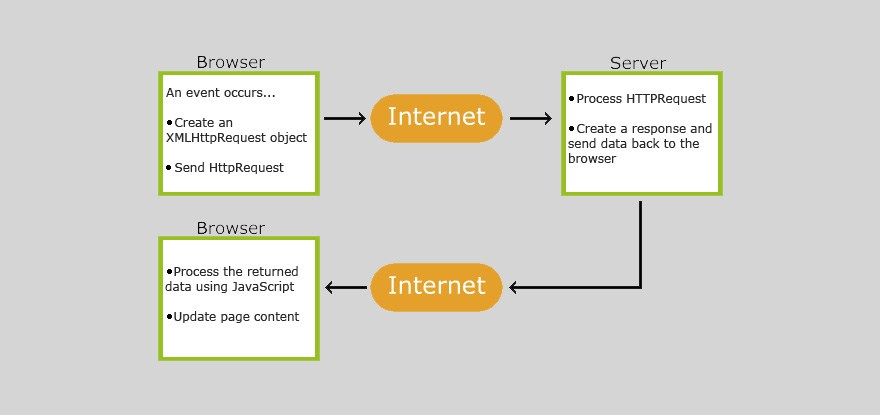

# AJAX Tutorial
This tutorial will introduce you to the basics of AJAX (Asynchronous JavaScript And XML) by building a basic web page that asks the user to input a number.  When the user clicks a button, AJAX will asynchronously request a pokemon that corresponds with that number by exposing the [pokeAPI](https://pokeapi.co/).

> This is an example of consuming a REST API.

AJAX stands for **A**synchronous **J**avaScript **A** nd **X**ML. AJAX allows web pages to be updated asynchronously by exchanging data with a web server behind the scenes. This means that it is possible to update parts of a web page, without reloading the whole page. This tutorial will show you how to create a webpage that does the following:

## How to Use This Demo
*Before attempting to code out this example yourself, scroll down and check out the fundamentals of AJAX.

1. Check out the `html` document [here](./ajax.html).
2. Create a new `.html` file in VSCode and type out the html you see in the example.
3. Create a new `.js` file in VSCode and link it to your html file.
    > Remember, always put your `<script>` tag in the bottom of the `<body>` of your `.html` file.
4. Follow the steps in the [ajax.js demo file](./ajax.js) - the notes are there to explain what's going on and how AJAX works behind the scenes. Type the same code into your personal `.js` file.
5. Get creative! Add some styling to your page, link to the Bootstrap4 CDN, or maybe swap out the Poke API for the [StarWars API](https://swapi.dev/). :slightly_smiling_face:	

## How AJAX Works

1. An event occurs in a web page (the page is loaded, a button is clicked)
2. An XMLHttpRequest object is created by JavaScript
3. The XMLHttpRequest object sends a request to a web server
4. The server processes the request
5. The server sends a response back to the web page
6. The response is read by JavaScript
7. Proper action (like page update) is performed by JavaScript