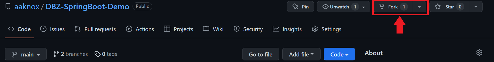
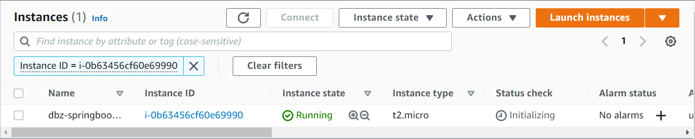

# How to Deploy your Spring Boot App to an EC2 instance in 7 Simple Steps
1. Fork this repository: https://github.com/aaknox/DBZ-SpringBoot-Demo
    - You should be able to find the Fork button here:
    

2. Navigate to the root project location in the terminal. 
- <strong>WARNING</strong>: You will need to make an RDS instance for your app to be able to persist data during runtime. Be sure to change the application.properties file's datasource URL to point to this instance instead of localhost before you do step 2.
- Run ```mvn clean install``` to prepare the JAR file that will be needed for the EC2 instance.
- This JAR file will be used later after you make your EC2 instance, so be sure you can find the JAR file in the ```target``` folder after running that command.

3. Once you have a successful JAR build of the Spring app, log into the AWS Management console.
    - Under the EC2 Dashboard, go to the Instances tab.
    - Click on "Launch instance".
    - Fill out the following information before you click on 'Launch instance' button at the bottom of this page under these sections:
        - Name & tags
            - Name: "dbz-springboot-app"
        - Application and OS Images (AMI)
            - AMI: Amazon Linux 2 AMI (should be in free-tier). Leave other setting here alone.
        - Instance type
            - Instance type: "t2-micro" (should be free-tier)
        - Key pair (login)
            - Here, click on "Create new key pair"
            - In the modal window, fill the following information:
                - Key pair name: "my-ec2-key"
                - Key pair type: RSA
                - Private key file format: ".pem"
                - Click "Create key pair". Window will close and download a new .pem file. 
                - Move this file to the root of your project for later.
        - Network settings
            - Click the Edit button in the top-right corner.
            - Go to Firewall.
            - Do the following:
                - Create new security group
                - Security group name: [your-initials]-security-group (ex. ak-security-group)
                - Description: whatever you want here (ex. allow ssh access to DBZ Spring Boot app)
                - Inbound security group rules = should be 4 in total:
                    - Type: ssh. Source: My IP
                    - Type: http. Source: Anywhere
                    - Type: https. Source: Anywhere
                    - Type: Custom TCP. Port: 8080. Source: Anywhere
        - Configure storage (skip this section)
        - Advanced details (skip this section)
    - Review the summary at bottom before finished.

4. Now that you have your new EC2 instance, it's time to connect to your EC2 instancy. 
- You should be able to find it back on the Instances tab like this:

- Click on the blue Instance ID link to view your EC2 instance summary.
- Make sure your Instance state is at "running" before proceeding to click on the "Connect" button.
- On the Connect to Instance page, click on the SSH Client tab.

5. Create a new repository on GitHub called "MyEC2Challenge-[your-initials]".
    - Open your terminal.
    - Clone your new repo to your local machine. Place the JAR file and .pem file inside of the repo directory and push it up to GitHub.
    - Navigate to the location of your MyEC2Challenge folder.
    - Follow the instructions from the SSH client tab on AWS to connect to your EC2 instance from your terminal.
        - Copy and paste the chmod command
        - SSH into your EC2 instance by copy and paste the ssh command that allows you to connect to your Linux EC2 instance with your pem key, similar to this:
```
ssh -i "my-key-pair.pem" ec2-user@ec2-18-224-70-167.us-east-2.compute.amazonaws.com
```

6. Once connected to your EC2, deploy your project onto it. Follow the following steps:
- a. Setup your EC2 environment with following commands:
```bash
sudo yum update
sudo yum install java-1.8.0-openjdk-devel -y
sudo yum install git -y
```

- b. Create a personal access token for your repo so you can clone the repo to the EC2 instance.
    - Follow instructions [here](https://docs.github.com/en/authentication/keeping-your-account-and-data-secure/creating-a-personal-access-token)
    - You should be able to clone the repo from here:
        - You will be prompted by Git to provide the following:
            - Username: your GitHub handle
            - Password: the PAT token

- c. Now run the following commands to deploy your Spring app to the EC2:
```bash
# Navigate to your app root folder in EC2

# Now run the Spring Boot with this:
java -jar DBZ-API-0.0.1-SNAPSHOT.jar
```

- d. Navigate to your EC2 endpoint on port 8080 to view your application hosted on Tomcat:
    - ex. http://54.197.40.41:8080/actuator/health
        - 54.....41 = Public IPv4 address from AWS
        - 8080 = port number for Tomcat
        - rest of URI will come from how you set up the backend
    - Control + C to stop program
    - Type exit into terminal to leave EC2 instance

7. Done! 

# References:
- [CloudKatha Guide to Deploy Spring App to EC2](https://cloudkatha.com/how-to-deploy-spring-boot-application-on-aws-ec2/)