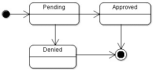
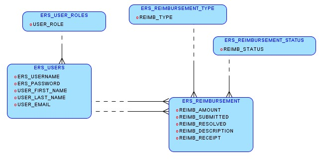
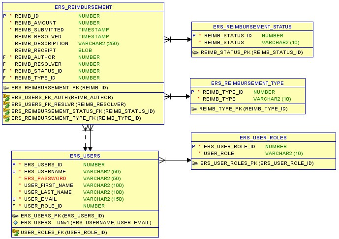
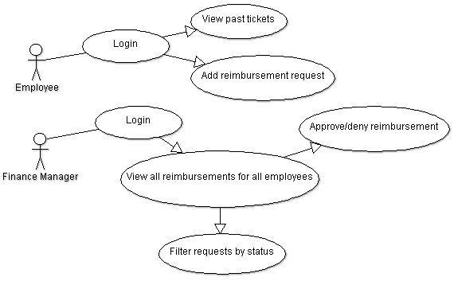
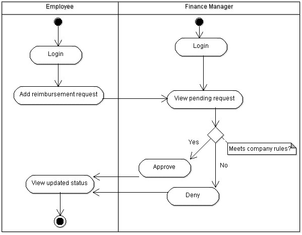

# Foundational Project Specs
> For your Foundational Project, you will be building a Java application that will be presented on *Friday, August 26th, 2022 at 10:00AM EST*.    You must meet the requirements for minimal viable product (MVP) that CoE has highlighted in their document [here](./Foundations%20Project%20Requirements.pdf).

The subject/theme that your ERS project focuses on is completely up to you:
ex. 
- Retail
- University
- Bank
- etc.

## Flowcharts
**State-chart Diagram (Reimbursement Statuses)** 
 

 

**Reimbursement Types**
Employees must select the type of reimbursement as: LODGING, TRAVEL, FOOD, or OTHER.
 

**Logical Model**
 

 

**Physical Model**
 

 

**Use Case Diagram**
 

 

**Activity Diagram**
 

 

## Tech Stack
Regardless of the project concept you choose, you will be required to adhere to the following tech stack:
- [ ] Java 8
- [ ] Apache Maven
- [ ] PostgreSQL (hosted on AWS RDS or localhost)
- [ ] Git SCM (hosted on GitHub)
- [ ] Postman

## Repo Instructions
- Create a new private repository within this organization (naming convention: `firstname_lastname_p1`)
- Add your trainer as a contributor to the repository
- Put your project concept user stories on your README.md
- Keep this repository up to date with frequent commits and pushes (follow best practices!)
- It is recommended (though not required) that you implement some kind of branching strategy when implementing new features into your application

## Presentation
- [ ] finalized version of application must be pushed to personal repository within this organization by the presentation deadline
- [ ] 5-7 minute live demonstration of the implemented features in front of cohort, trainer, and QC